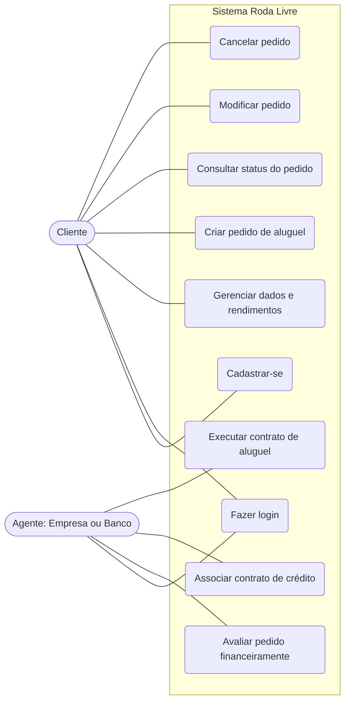

# Diagrama de Casos de Uso, Roda Livre

```mermaid
flowchart LR
    Cliente([Cliente])
    Agente([Agente: Empresa ou Banco])

    subgraph Sistema Roda Livre
        UC1(Cadastrar-se)
        UC2(Fazer login)
        UC3(Gerenciar dados e rendimentos)
        UC4(Criar pedido de aluguel)
        UC5(Consultar status do pedido)
        UC6(Modificar pedido)
        UC7(Cancelar pedido)
        UC8(Avaliar pedido financeiramente)
        UC9(Associar contrato de crédito)
        UC10(Executar contrato de aluguel)
    end

    Cliente --- UC1
    Cliente --- UC2
    Cliente --- UC3
    Cliente --- UC4
    Cliente --- UC5
    Cliente --- UC6
    Cliente --- UC7
    Agente --- UC2
    Agente --- UC8
    Agente --- UC9
    Agente --- UC10
```