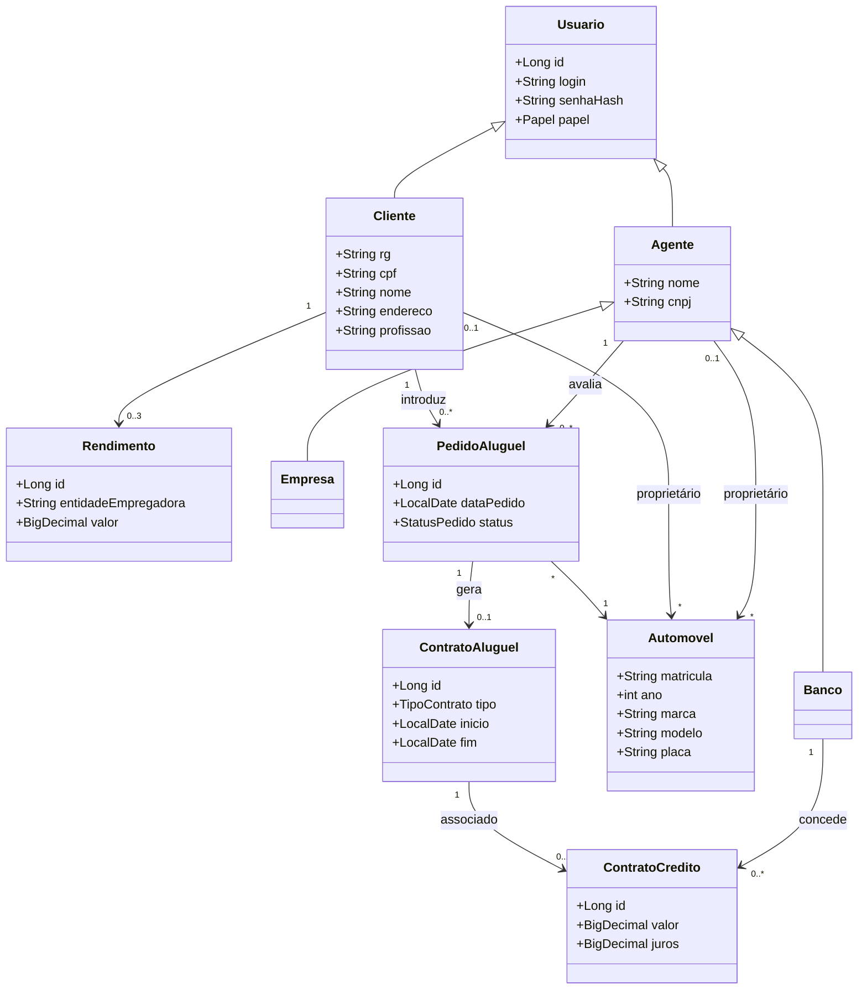

# Diagrama de Classes, Roda Livre

```mermaid
classDiagram
    class Usuario {
        +Long id
        +String login
        +String senhaHash
        +Papel papel
    }
    class Cliente {
        +String rg
        +String cpf
        +String nome
        +String endereco
        +String profissao
    }
    class Rendimento {
        +Long id
        +String entidadeEmpregadora
        +BigDecimal valor
    }
    class Agente {
        +String nome
        +String cnpj
    }
    class Empresa
    class Banco
    class Automovel {
        +String matricula
        +int ano
        +String marca
        +String modelo
        +String placa
    }
    class PedidoAluguel {
        +Long id
        +LocalDate dataPedido
        +StatusPedido status
    }
    class ContratoAluguel {
        +Long id
        +TipoContrato tipo
        +LocalDate inicio
        +LocalDate fim
    }
    class ContratoCredito {
        +Long id
        +BigDecimal valor
        +BigDecimal juros
    }

    Usuario <|-- Cliente
    Usuario <|-- Agente
    Agente <|-- Empresa
    Agente <|-- Banco
    Cliente "1" --> "0..3" Rendimento
    Cliente "1" --> "0..*" PedidoAluguel : introduz
    PedidoAluguel "*" --> "1" Automovel
    Agente "1" --> "0..*" PedidoAluguel : avalia
    PedidoAluguel "1" --> "0..1" ContratoAluguel : gera
    ContratoAluguel "1" --> "0..1" ContratoCredito : associado
    Banco "1" --> "0..*" ContratoCredito : concede
    Cliente "0..1" --> "*" Automovel : proprietário
    Agente "0..1" --> "*" Automovel : proprietário
```

Enums: `Papel` (CLIENTE, AGENTE), `StatusPedido` (EM_ANALISE, APROVADO, REJEITADO, CONTRATADO, CANCELADO), `TipoContrato`.