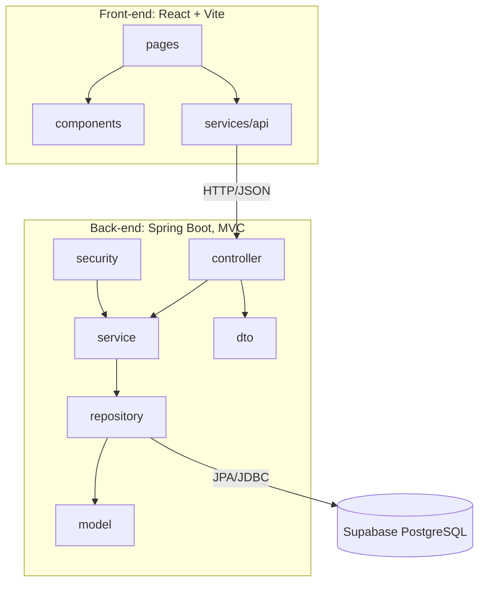

# Diagrama de Pacotes (Visão Lógica), Roda Livre

```mermaid
flowchart TB
    subgraph Frontend [Front-end: React + Vite]
        Paginas[pages]
        Componentes[components]
        Servicos[services/api]
    end
    subgraph Backend [Back-end: Spring Boot, MVC]
        Controller[controller]
        Service[service]
        Repository[repository]
        Model[model]
        Security[security]
        DTO[dto]
    end
    DB[(Supabase PostgreSQL)]

    Paginas --> Componentes
    Paginas --> Servicos
    Servicos -- HTTP/JSON --> Controller
    Controller --> Service
    Controller --> DTO
    Service --> Repository
    Repository --> Model
    Security --> Service
    Repository -- JPA/JDBC --> DB
```